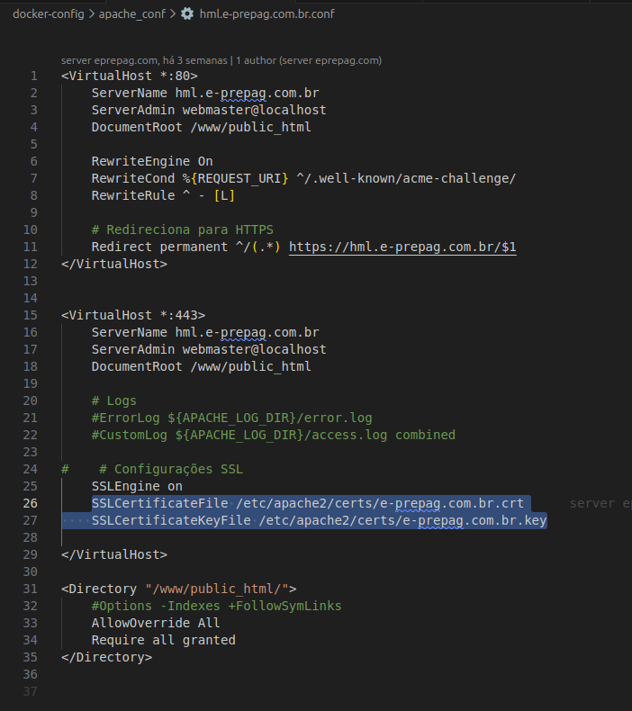

# Como rodar o ambiente localmente

Este guia explica como configurar o ambiente local com HTTPS usando **mkcert**, como ajustar o Apache, configurar o arquivo **.env**, editar o **hosts**, e rodar o ambiente com Docker.

---

## 🔐 1. Gerando certificados HTTPS locais com mkcert

Para usar HTTPS localmente, é necessário gerar certificados válidos. A forma mais simples é usando **mkcert**.

### **Instalar o mkcert**

Siga as instruções do repositório oficial dependendo do seu sistema operacional.

### **Inicializar o mkcert**

```bash
mkcert -install
```

Isso instala a autoridade certificadora local no seu sistema.

### **Gerar os certificados usados pelo projeto**

Execute o comando abaixo **na raiz do projeto**, gerando os arquivos nas pastas corretas:

```bash
mkcert -key-file docker-config/certs_local/e-prepag.com.br.key \
-cert-file docker-config/certs_local/e-prepag.com.br.crt \
localhost backoffice-dev.e-prepag.com.br dev.e-prepag.com.br
```

Isso criará dois arquivos:

* `docker-config/certs_local/e-prepag.com.br.key`
* `docker-config/certs_local/e-prepag.com.br.crt`

Esses arquivos serão usados pelo Apache dentro do Docker.

---

## 🛠️ 2. Configurações do Apache

Os arquivos de configuração do Apache ficam em:

* `docker-config/apache_conf/hml.e-prepag.com.br.conf`
* `docker-config/apache_conf/backoffice-hml.e-prepag.com.br.conf`

Dentro desses arquivos existe a configuração apontando para os certificados.

### Exemplo visual de onde colocar as chaves



Certifique-se de que o caminho no Dockerfile ou docker-compose mapeia:

```
docker-config/certs_local:/etc/apache2/certs
```

---

## 📄 3. Coloque o arquivo `.env`

O arquivo `.env` deve estar dentro da pasta:

```
www/
```

Sem o `.env` o sistema não funcionará corretamente.

---

## 🖥️ 4. Adicione os domínios no arquivo *hosts*

Para que o navegador encontre seu ambiente local, adicione:

```
127.0.0.1   backoffice-dev.e-prepag.com.br
127.0.0.1   dev.e-prepag.com.br
```

### 📌 **Como editar o hosts:**

#### **Windows**

1. Abra o **Bloco de Notas como Administrador**
2. Abra o arquivo:

```
C:\Windows\System32\drivers\etc\hosts
```

3. Adicione as linhas e salve.

#### **macOS**

1. Abra o Terminal
2. Execute:

```bash
sudo nano /etc/hosts
```

3. Adicione as linhas e salve com **CTRL+O**.

#### **Linux**

1. Abra o terminal
2. Execute:

```bash
sudo nano /etc/hosts
```

3. Salve.

---

## 🐳 5. Rodando o ambiente com Docker

Na raiz do projeto execute:

### **Build da imagem:**

```bash
docker compose -f docker-compose_dev.yml build
```

### **Subir os containers em background:**

```bash
docker compose -f docker-compose_dev.yml up -d
```

### **Ver logs da aplicação:**

```bash
docker logs -f eprepagapp-app-1
```

Se aparecer que está "listening" ou sem erros, está rodando.

---

## 🌐 6. Acessar o ambiente local

Depois de tudo configurado, acesse:

* [https://dev.e-prepag.com.br](https://dev.e-prepag.com.br)
* [https://backoffice-dev.e-prepag.com.br](backoffice-dev.e-prepag.com.br)

---

## 💡 7. Recomendação: Use documentação do Apache, Docker ou IA para erros desconhecidos

Se aparecer qualquer erro estranho no log, mensagem incomum ou comportamento inesperado, recomendo perguntar para uma **IA** com a mensagem completa do erro.

---

## ⚠️ 8. Erros comuns

### ❌ Usar o docker-compose errado

* **NÃO** rodar: `docker-compose-hml.yml` (este é para homologação real, não local)
* O correto é rodar **apenas**:

```
docker-compose_dev.yml
```

### ❌ Pastas erradas nos caminhos do Docker

Sempre confirme se os caminhos no Dockerfile e no docker-compose apontam para:

* `www/`
* `docker-config/apache_conf/`
* `docker-config/certs_local/`

Erros nesses caminhos são a causa mais comum de falha no start do container.

---

## 📝 9. Codificação dos arquivos PHP (ISO-8859-1)

A maior parte dos arquivos PHP deste projeto utiliza ISO‑8859‑1 como codificação padrão. Por isso, é importante configurar seu editor para reconhecer esse encoding ao abrir e salvar arquivos.

### 🔧 Como configurar no VS Code

Adicione no arquivo .vscode/settings.json (ou nas Configurações do Workspace):

```
{
    "files.encoding": "iso88591"
}
```

Isso garante que os arquivos PHP serão abertos e salvos corretamente.

#### 🖊️ Outros editores

- Se você usa outro editor (PHPStorm, Sublime, Notepad++, Vim, etc.), procure nas configurações algo como:

- Encoding / File Encoding

- Default Encoding

- Fallback Encoding

- Save with encoding

Configure para ISO‑8859‑1 para projetos PHP.

### ⚠️ Importante

Outros arquivos do projeto não usam ISO‑8859‑1. Em especial:

- Dockerfile

- docker-compose

- arquivos YAML

- JSON

- Markdown

- Scripts Shell

- configurações diversas

Esses arquivos devem permanecer em UTF‑8 (sem BOM), que é o padrão dos editores modernos.
